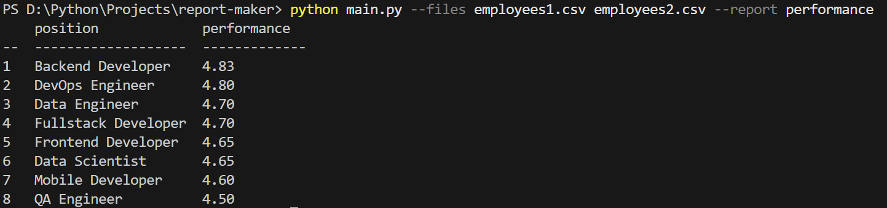

# Report Maker
Данный скрипт читает файлы с данными о закрытых задачах, формирует отчеты и выводит их в консоли.


## Установка и запуск
1. **Создайте локальную копию репозитория**:
   ```shell
   git clone https://github.com/blackmidinewroad/report-maker.git
   cd report-maker
   ```


2. **Установите необходимые зависимости**
   - Используя `pip`:
   
      ```shell
      pip install -r requirements.txt
      ```

   - Используя `pipenv`:

      ```shell
      pipenv install
      ```


3. **Запустите скрипт**:
   ```shell
    python main.py --files <paths/to/empl/files> --report <report_name>
   ```
   Используйте `python3` на macOS.

   - Замените `paths/to/empl/files` на реальные пути к файлам (разделенные пробелами) с данными о закрытых задачах (например, если файлы в корне проекта: `employees1.csv employees2.csv`; или используя полные пути: `C:\Users\JohnDoe\Downloads\employees1.csv C:\Users\JohnDoe\Downloads\employees2.csv`)   
   - Замените `report_name` на реальное название отчета (на данный момент доступно только `performance`)


## Пример запуска скрипта



## Запуск тестов
   ```shell
    python -m pytest
   ```
